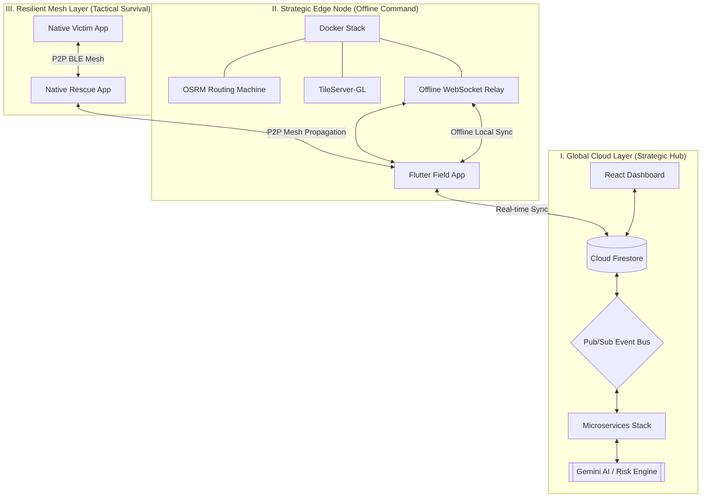

# 📑 Project Deck Content: SupplyGuard AI

Use the information below to fill out your Prototype Deck. These answers are tailored to your specific codebase and technical architecture.

---

## 1. List of Features Offered by the Solution
- **Resilient Mesh Communication**: P2P Bluetooth/Wi-Fi mesh networking that works without internet or cellular coverage.
- **AI-Powered Risk Scoring**: Real-time evaluation of disaster zones using environmental and sensor data.
- **Dynamic Route Optimization**: Automated rerouting of supply vehicles to avoid high-risk areas.
- **Digital Twin Simulation**: "What-If" scenario modeling to test logistics resilience before deployment.
- **Automated Drone Dispatch**: Rapid delivery of life-saving supplies (medicine, food) to isolated clusters.
- **Explainable AI (XAI)**: Human-readable rationale for every system decision generated by Google Gemini.
- **Field Agent Dashboard**: Offline-first mobile app for rescue workers with persistent mapping.

---

## 2. Process Flow / Use-Case Diagram
**Scenario: Bridge Collapse on Supply Route**
1. **Detection**: Ingestion service detects a road-closure signal from a sensor or field report.
2. **Analysis**: Risk Engine identifies shipments heading toward the closure and calculates a high danger score.
3. **Optimization**: Route Optimizer finds the fastest safe alternative path.
4. **Coordination**: Command Center approves the new route; Field App (Flutter) receives the update via sync.
5. **Recovery**: If a vehicle is trapped, it uses the **Android Mesh** to broadcast an SOS to nearby rescue teams.

---

## 3. Robust System Architecture
The SupplyGuard AI architecture is designed for **High Availability** and **Zero-Failure** operations. It utilizes a hybrid cloud-edge model to maintain situational awareness even when global networks are severed.

---

## 4. Advanced Tech Stack
- **Command & Control**: React 19 + TypeScript + Tailwind CSS (Vite optimized).
- **Event-Driven Backend**: Node.js microservices coordinated via **Google Cloud Pub/Sub**.
- **Edge Deployment**: **Docker Compose** orchestrating OSRM (Routing), TileServer (Offline Maps), and Express Relay servers.
- **Native Android Mesh Suite (Gradle/Kotlin)**: 
    - **:core**: Shared Room Database & Retrofit networking.
    - **:victim / :rescue**: High-resilient P2P communication using **Bluetooth Low Energy (BLE)** and **Wi-Fi Direct**.
- **Unified Field Operations**: **Flutter 3.24** (Cross-platform command interface for field agents).
- **Intelligence Layer**: **Google Gemini 1.5 Pro** for explainable logistics and automated impact reports.
- **Persistence**: **Firestore** (Real-time NoSQL) + **SQLite/Room** (Edge/Local persistence).

---

## 5. Estimated Implementation Cost (Prototyping Phase)
- **Firebase/Cloud**: $0 - $50/mo (within free tiers for MVP).
- **Google Maps API**: $200/mo (free credit usually covers MVP usage).
- **Gemini API**: Pay-per-token (Minimal for demo purposes).
- **Hardware**: Standard Android smartphones and laptops (No specialized hardware required).

---

## 6. Snapshots of the MVP (Visual Guide)
*For your slides, take these screenshots:*
1. **The Global Map**: Show the React Dashboard with multiple moving shipment markers and "Red" risk zones.
2. **The Decision Panel**: Show the sidebar where Gemini AI explains why a route was changed.
3. **The SOS Screen**: Show the Native Android "Victim" app with the big SOS button active.
4. **The Mesh Feed**: Show the "Rescue" app receiving a notification from a device that is "Offline."

---

## 7. Additional Details & Future Development
- **Starlink Integration**: Direct satellite uplink for the Local Relay Server in total blackout zones.
- **Swarm Intelligence**: Autonomous drone swarms that can "search and find" victim clusters using thermal imaging.
- **Wearable Integration**: Syncing heart-rate and health data from smartwatches via the mesh network to prioritize medical rescues.
- **Predictive Disaster Modeling**: Using historical data to predict where infrastructure failure is most likely to happen *before* the disaster hits.
