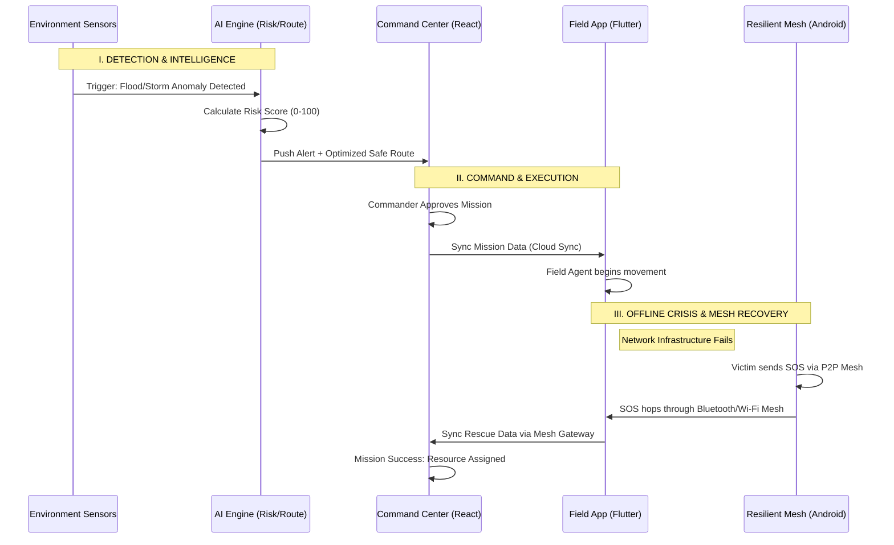
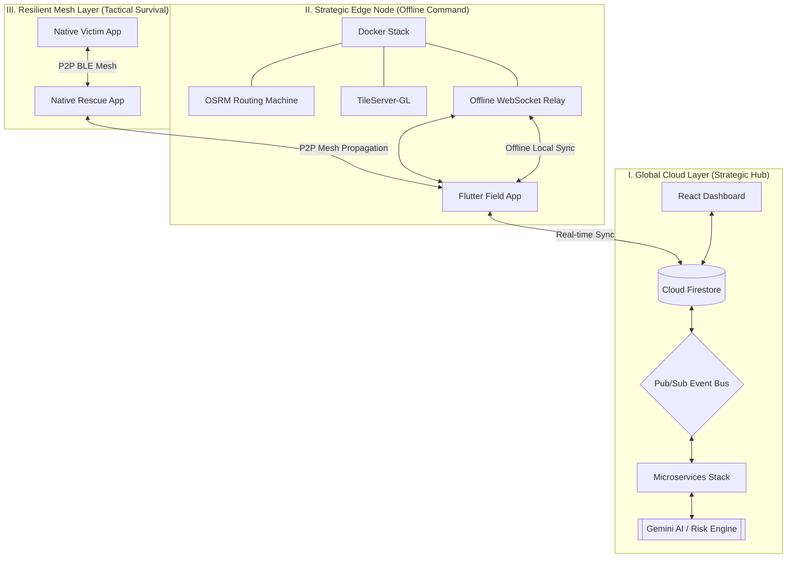

# 📑 Project Deck Content: SupplyGuard AI

Use the information below to fill out your Prototype Deck. These answers are tailored to your specific codebase and technical architecture.

---

## 1. List of Features Offered by the Solution
- **Resilient Mesh Communication**: P2P Bluetooth/Wi-Fi mesh networking that works without internet or cellular coverage.
- **AI-Powered Risk Scoring**: Real-time evaluation of disaster zones using environmental and sensor data.
- **Dynamic Route Optimization**: Automated rerouting of supply vehicles to avoid high-risk areas.
- **Digital Twin Simulation**: "What-If" scenario modeling to test logistics resilience before deployment.
- **Automated Drone Dispatch**: Rapid delivery of life-saving supplies (medicine, food) to isolated clusters.
- **Explainable AI (XAI)**: Human-readable rationale for every system decision generated by Google Gemini.
- **Field Agent Dashboard**: Offline-first mobile app for rescue workers with persistent mapping.

---

## 2. Integrated Process Flow: "Crisis to Resolution"
This diagram tracks the lifecycle of a rescue mission, from the first anomaly detection to an offline P2P mesh rescue.

---

## 3. Robust System Architecture
The SupplyGuard AI architecture is designed for **High Availability** and **Zero-Failure** operations. It utilizes a hybrid cloud-edge model to maintain situational awareness even when global networks are severed.

---

## 4. Advanced Tech Stack
- **Command & Control**: React 19 + TypeScript + Tailwind CSS (Vite optimized).
- **Event-Driven Backend**: Node.js microservices coordinated via **Google Cloud Pub/Sub**.
- **Edge Deployment**: **Docker Compose** orchestrating OSRM (Routing), TileServer (Offline Maps), and Express Relay servers.
- **Native Android Mesh Suite (Gradle/Kotlin)**: 
    - **:core**: Shared Room Database & Retrofit networking.
    - **:victim / :rescue**: High-resilient P2P communication using **Bluetooth Low Energy (BLE)** and **Wi-Fi Direct**.
- **Unified Field Operations**: **Flutter 3.24** (Cross-platform command interface for field agents).
- **Intelligence Layer**: **Google Gemini 1.5 Pro** for explainable logistics and automated impact reports.
- **Persistence**: **Firestore** (Real-time NoSQL) + **SQLite/Room** (Edge/Local persistence).

---

## 5. Estimated Implementation Cost (Prototyping Phase)
- **Firebase/Cloud**: $0 - $50/mo (within free tiers for MVP).
- **Google Maps API**: $200/mo (free credit usually covers MVP usage).
- **Gemini API**: Pay-per-token (Minimal for demo purposes).
- **Hardware**: Standard Android smartphones and laptops (No specialized hardware required).

---

## 6. Snapshots of the MVP (Visual Guide)
*For your slides, take these screenshots:*
1. **The Global Map**: Show the React Dashboard with multiple moving shipment markers and "Red" risk zones.
2. **The Decision Panel**: Show the sidebar where Gemini AI explains why a route was changed.
3. **The SOS Screen**: Show the Native Android "Victim" app with the big SOS button active.
4. **The Mesh Feed**: Show the "Rescue" app receiving a notification from a device that is "Offline."

---

## 7. Additional Details & Future Development
- **Starlink Integration**: Direct satellite uplink for the Local Relay Server in total blackout zones.
- **Swarm Intelligence**: Autonomous drone swarms that can "search and find" victim clusters using thermal imaging.
- **Wearable Integration**: Syncing heart-rate and health data from smartwatches via the mesh network to prioritize medical rescues.
## 8. Strategic Positioning & Impact

### **Opportunities**
- **Governmental Adoption**: Scalable for national disaster response agencies (e.g., NDRF, FEMA) to coordinate large-scale evacuations.
- **Supply Chain Resilience**: Commercial logistics companies can integrate the Risk/Route engines to ensure zero-disruption delivery of essential goods during extreme weather.
- **Smart City Integration**: Proactive incident management by connecting directly to municipal sensor networks and infrastructure.

### **How different is it from existing ideas?**
- **Offline-First vs. Cloud-Only**: Traditional disaster apps stop working when cell towers fail. SupplyGuard AI is built on a **"Triple-Resilience"** model that defaults to P2P Mesh when the cloud is unreachable.
- **Integrated AI Explainer**: Unlike "black-box" systems, our integration with Gemini AI provides commanders with natural language rationales for automated rerouting and drone dispatches.
- **Hybrid Infrastructure**: Combines high-level React dashboards with low-level Android hardware mesh (BLE/Wi-Fi Direct) in a single unified ecosystem.

### **How will it solve the problem?**
- **Closing the Communication Gap**: By using the **Android Mesh**, we ensure that SOS signals from victims reach rescuers even in "blackout" zones.
- **Reducing Decision Fatigue**: AI engines automate the complex math of risk and pathfinding, allowing human commanders to focus on life-saving priorities.
- **Data Persistence**: The system uses a specialized sync engine that caches data at the edge and automatically reconciles with the cloud once a single node reaches a gateway.

### **USP (Unique Selling Point)**
**"The Zero-Infrastructure Lifecycle"**: SupplyGuard AI is the only solution that maintains a full operational loop—from AI-driven detection to P2P-driven rescue—even when 100% of the public communication infrastructure has collapsed.
