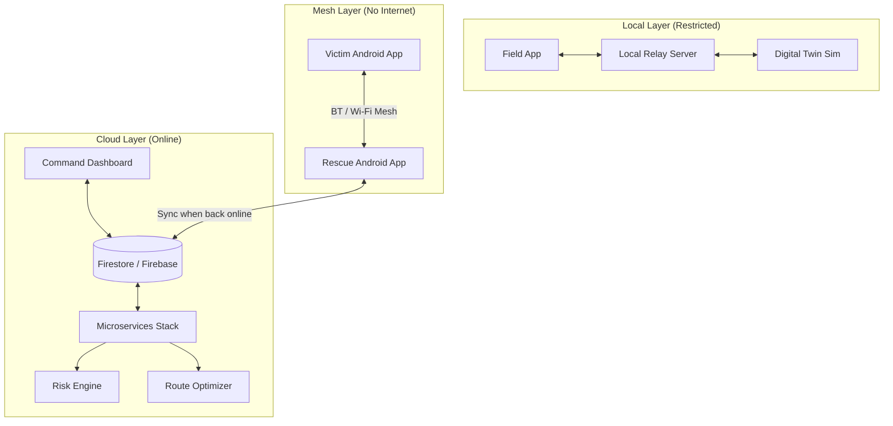

# 🛡️ SupplyGuard AI: Resilient Disaster Logistics

[](https://opensource.org/licenses/Apache-2.0)
[](https://github.com/VyshrawanP/SupplyGuardAI)
[](https://supplyguard-ai.web.app)

**SupplyGuard AI** is a mission-critical disaster logistics ecosystem designed to maintain operational visibility and coordination when the world goes dark. It ensures that life-saving supplies reach their destination even when communication infrastructure collapses.

---

## 🚨 Problem Statement
In the immediate aftermath of a disaster (the "Golden 72 Hours"), communication infrastructure—cell towers, fiber optics, and power grids—often fails. This leads to **"Logistics Blackouts"**:
-   **Rescue teams** lose real-time visibility of victim locations.
-   **Supply chains** cannot reroute around destroyed roads.
-   **Decision-makers** fly blind, unable to assess risk or coordinate drone dispatches.

## 💡 Solution Overview
SupplyGuard AI provides a **Triple-Layered Resilience Stack** to bridge the communication gap:
1.  **Cloud Command Center**: High-fidelity React dashboard for global situational awareness.
2.  **Field Operations App**: Flutter-based mobile app for field agents with offline mapping.
3.  **Resilient Mesh (Android)**: P2P Bluetooth/Wi-Fi mesh networking that allows victims and rescuers to communicate without any internet or cellular service.
4.  **AI Orchestration**: Integrated engines for Risk Scoring, Route Optimization, and Anomaly Detection to automate complex logistics.

---

## 🏗️ System Architecture

### The Resilience Stack
SupplyGuard AI uses a hybrid architecture to ensure 100% uptime:



---

## 🚀 Live Prototype & Submission Links

-   **Live MVP Dashboard**: [supplyguard-ai.web.app](https://supplyguard-ai.web.app)
-   **Prototype Deck**: [View on Google Slides/PDF](#) *(Update with your link)*
-   **Demo Video**: [Watch on YouTube](#) *(Update with your link)*
-   **Technical Audit**: [View Full Audit](./TECHNICAL_AUDIT.md)

---

## 🛠️ Key Features

### 1. Offline Mesh Networking
Native Android apps (Victim & Rescue) that form a decentralized network using Bluetooth Low Energy (BLE) and Wi-Fi Direct. SOS signals propagate through the mesh until they reach a device with a connection.

### 2. Digital Twin Simulation
A simulation engine that clones the entire logistics state to model "What-If" scenarios (e.g., "What if this bridge collapses?"). It uses deterministic risk scoring to predict delays and inventory shortages.

### 3. AI-Driven Decision Support
-   **Risk Engine**: Real-time scoring (0-100) based on weather, terrain, and sensor data.
-   **Route Optimizer**: Dynamically reroutes supply trucks to avoid high-risk disaster zones.
-   **AI Explainer**: Uses Google Gemini to generate human-readable explanations for every automated decision.

---

## 📦 Project Structure

```text
SupplyGuardAI/
├── src/                # React Command Center (Web)
├── frontend/           # Flutter Field App (Mobile/Web)
├── android-apps/       # Native Android Mesh Suite (Kotlin)
├── backend/            # Microservices (Node.js/TypeScript)
│   ├── api-gateway/    # Central Entry Point
│   ├── risk-engine/    # AI Risk Scoring
│   ├── route-optimizer/# Dynamic Rerouting
│   └── ...             # 8+ other specialized engines
├── server.ts           # Unified Demo/Relay Server
└── docker/             # Full Offline Deployment Config
```

---

## 🚦 Getting Started (5-Minute Run)

### 1. Prerequisites
-   Node.js 20+
-   Flutter 3.24+
-   Android Studio (for Mesh Apps)

### 2. Setup
```bash
# Clone and install
git clone https://github.com/VyshrawanP/SupplyGuardAI
npm install

# Configure
cp .env.example .env
# Add your API keys for Google Maps & Gemini
```

### 3. Run Development Server
```bash
npm run dev
```
Access the dashboard at `http://localhost:3000`.

---

## 🛡️ Responsible AI & Privacy
SupplyGuard AI is built with privacy-first principles. Mesh communication is end-to-end encrypted, and AI explanations are grounded in deterministic data to prevent hallucinations during critical missions.

---

## 📜 License
Apache License 2.0 - See [LICENSE](LICENSE) for details.
