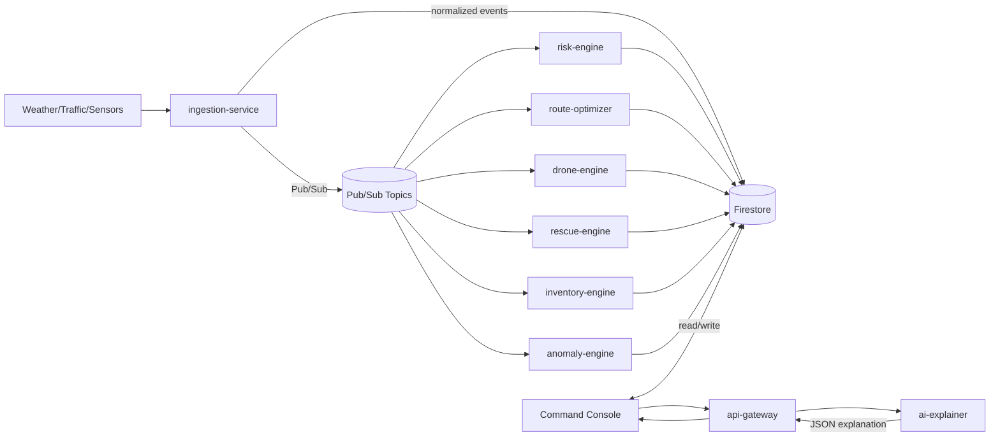

# Architecture (High-level)

## Components

- **Command Console (Web)**: `src/` (React + Vite)
- **Field App (Flutter)**: `frontend/`
- **Backend services (Cloud Run / local)**: `backend/*`
- **Firestore**: operational state + events
- **Pub/Sub**: event-driven fanout between services
- **Offline stack**: Docker Compose + SQLite + WS signaling

## Data flow (Cloud)

## Offline mode

Offline mode focuses on **repeatable simulation + local coordination**, not external API availability:

- Local simulation and UI flows work without OpenWeather / Google Maps keys.
- WebSocket signaling supports local device pairing for mesh alerts.

